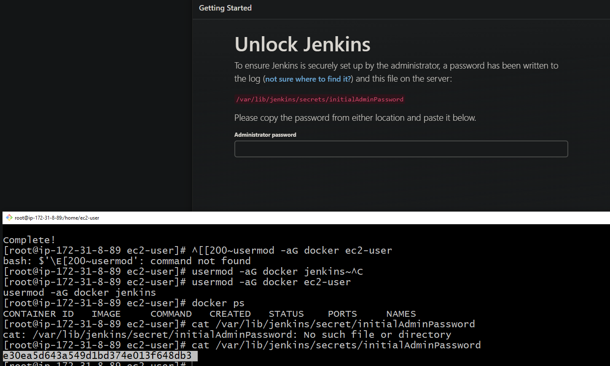
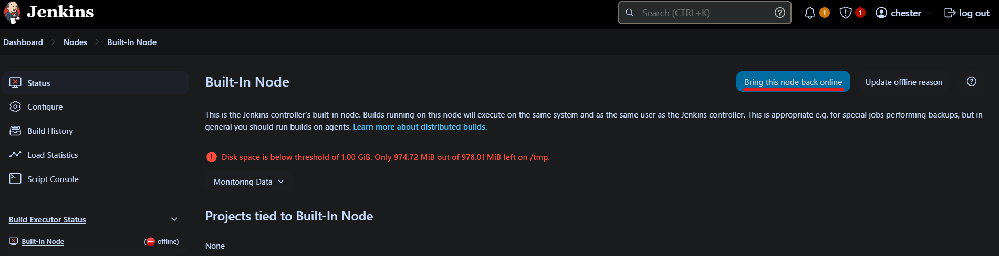

# Jenkins Continuous Integration Server w/ Docker

Goal: Generate a CI/CD Pipeline with Jenkins to build & deploy both our Backend & Frontend Application on docker containers exposed to the internet.

## Chapters

1. [Requirements](#requirements)
2. [Install Jenkins & Docker on VM](#installation-steps-for-jenkins--docker-on-vm)
3. [Configure Backend](#configuration-of-backendspring-for-deployment-on-jenkins)
4. [Configure Frontend](#configuration-of-frontendvitereact-for-deployment-on-jenkins)
5. [Configure Jenkins Pipeline](#configure-jenkins-build-pipeline)

# Requirements

1. Virtual Machine on Cloud Provider (AWS EC2, Azure Virtual Machines, GCP Compute Engine)
    - 1 vCPU min
    - 2 GB RAM min
    - 10+GB Storage
2. Git
3. Docker

## Installation Steps for Jenkins & Docker on VM
(BE MINDFUL examples may contain AWS specific use cases)

1. First we will need a VM instance from a cloud provider with the above hardware requirements. *This will allow us to run docker containers for both our Backend & Frontend with a single jenkins server.
    - ***NOTE*** If you wish to ssh from your machine to the VM, please make sure you create & download the keypair made during the configuration of your VM.
2. Once the instance has been created connect to the Virtual Machine using either the built in browser terminal on the cloud provided or by ssh in from your computer's terminal.
    ```sh
    # ssh -i <keypair-file> <username>@<public-ip-address-to-VM>
    ssh -i aws-jenkins.pem e2-user@31.121.4.67
    ```
3. Use the `sudo` command to log in as the root user, these removes the need to put sudo before every command in the next step
    ```bash
    # log in as root (prevents need for sudo in front commands)
    sudo su
    ```
4. Next we need to configure our VM Instance through the following executions
    ```bash
    yum install git -y
    yum install java-17 -y
    yum install fontconfig -y

    # Jenkins installation
    wget -O /etc/yum.repos.d/jenkins.repo \
    https://pkg.jenkins.io/redhat-stable/jenkins.repo
    rpm --import https://pkg.jenkins.io/redhat-stable/jenkins.io-2023.key
    dnf upgrade
    yum install jenkins -y
    systemctl daemon-reload

    systemctl enable --now jenkins
    systemctl start jenkins

    # Docker Installation
    yum install docker -y
    systemctl start docker
    systemctl enable --now docker

    # Adds ec2-user & jenkins to the docker group, allowing for execution   of docker on the VM
    usermod -aG docker ec2-user 
    usermod -aG docker jenkins 
    ```
5. Next we go through the configuration our our Jenkins Server via the hosted URL with port 8080
    - ***NOTE*** These request need to be through an http:// url, NOT a https:// otherwise it will say it cannot secure connection
    - Examples url from AWS: `http://ec2-3-144-27-185.us-east-2.compute.amazonaws.com:8080`
    - Add the URL you'll be presented with thiss screen where you must return to your VM terminal to execute the `cat` command on the file presented by Jenkins. Copy the output from the command and enter into the browser.
        ```bash
        cat /var/lib/jenkins/secrets/initialAdminPassword
        ```
        
   
    - Now, click `Install Suggested Plugins`
    - Next, create a login for your application so you don't need to reobtain this password. Please make sure you utilize a username and password you won't forget.'
    - `Instance Configuration` leave as default and click `Save and Finish`
    - Click `Start using Jenkins` to navigate to the Jenkins Dashboard
    - You should then be presented with the dashboard
6. Click `Manage Jenkins` - We need to quickly setup our nodes so the built-in executor can still operate. Otherwise we will have to manually run the node, defeating the purpose of Jenkins.

    
    
    - **OPTIONALLY**: If you want Dark Mode, while we are here you can also, click `Appearance` and set theme to `Dark` and click `Save`
        
    

7. While here, we need to click `Configure Monitors`.

    

8. Check all boxes with `Don't mark agents temporarily offline`. Click `Save`

    

9. Back at the Nodes pages, look the to the left hand navigation window & click `Built-In Node`

    

10. From here we just need to click `Bring this node back online` which should help keep our built-in node running to handle any stages from our pipelines later.

    

6. We reboot our server, afterwards you'll have to reconnet via step #2 `ssh` command. In the meanwhile, you can prepare your backend and frontend with the files specified below if you haven't already.:
    ```bash
    reboot
    ```

## Configuration of Backend(Spring) for Deployment on Jenkins

Don't forget that once we update the frontend section to make sure the URL our frontend is hosted on is included in our `@CrossOrigins(origins = {"<hosted-url-here>"})` 

***NOTE***: These examples include information that should be replaced with your own information & configuration needs, marked with `#CHECK CONFIG`

### Obfuscate sensitive information

```yaml
# Environment variable set for password value
spring:
  datasource:
    url: jdbc:postgresql://ams-database.ciotsjjufktg.us-east-2.rds.amazonaws.com:5432/postgres #CHECK CONFIG
    username: postgres #CHECK CONFIG
    password: ${DBPASS}
    driver-class-name: org.postgresql.Driver #CHECK CONFIG
  jpa:
    properties:
      hibernate:
        dialect: org.hibernate.dialect.PostgreSQLDialect #CHECK CONFIG
        ddl-auto: update
    show-sql: true
server:
  port: 9999 #CHECK CONFIG
```

### Dockerfile

```Dockerfile
FROM openjdk:17-alpine #CHECK CONFIG

WORKDIR app/

COPY . .

RUN chmod +x mvnw 

ENV PORT=9999 #CHECK CONFIG

ENTRYPOINT ["./mvnw", "spring-boot:run"]
```

### Jenkinsfile

```groovy
// root executable for the groovy file to know it's working with a pipeline
pipeline{

    // will find any available agent
    agent any

    // Setup environment to pull from the jenkins global for the credentials
    environment{
        // Global Variables from Jenkins
        dockerHub = credentials('dockerHub')
        DBPASS = credentials('DBPASS')

        // Custom Variables for this Jenkinsfile only
        SERVICE = "ams-backend" // #CHECK CONFIG
        VERSION = "${env.BUILD_ID}"
        IMAGE = "${dockerHub_USR}/${SERVICE}:${VERSION}"
        CONTAINER = "${SERVICE}-service" 
    }

    // definte all of the stages
    stages{

        // First stage is the build & deliver and name it
        stage('Build & Deliver'){

            // Steps are all of the executables on shell, use "" when using environment variables
            steps{
                sh "docker login -u ${dockerHub_USR} -p ${dockerHub_PSW}"
                sh "docker build -t ${IMAGE} ."
                //pushes image to dockerHub
                sh "docker push ${IMAGE}"
            }

        }

        // stage to stop all running contianers & remove them
        stage("Stop & Destroy"){
            steps{
                catchError(buildResult: 'SUCCESS', stageResult: 'FAILURE'){
                    sh "docker stop ${CONTAINER}"
                    sh "docker rm ${CONTAINER}"
                }
            }
        }

        stage('Deploy'){

            steps{
            // docker run, but we've add the -e flag to pass the environment variable defined in Jenkins to the our Docker Container
            // so our application.yml has context for what's there
                sh "docker run --name ${CONTAINER} -e DBPASS=${DBPASS} -d -p 8888:9999 ${IMAGE}" // #CHECK CONFIG ports
            }

        }

    }


}
```

## Configuration of Frontend(Vite+React) for Deployment on Jenkins

Don't forget that once we update the backend section to make sure the URL our axios or fetch url is using is updated to  `axios.get(<hosted-url-here>)` and `fetch(<hosted-url-here>)`. You may have also setup an `axios.create()` and supplied a JavaScript object for the configuration to include a `baseURL: "<hosted-url-here>"`.

### Vite Server Config

```ts
import { defineConfig } from 'vite'
import react from '@vitejs/plugin-react'

// https://vitejs.dev/config/
export default defineConfig({
  plugins: [react()],
  server: {
    watch: {
      usePolling: true,
    },
    host: true, // needed for the Docker Container port mapping to work
    strictPort: true,
    port: 5173, // #CHECK CONFIG, you can replace this port with any port
  }
})

```

### Dockerfile

```Dockerfile
FROM node:20 #CHECK CONFIG

WORKDIR /app

COPY package.json .

RUN npm install

COPY . .

EXPOSE 5173 #CHECK CONFIG

CMD [ "npm", "run", "dev" ]
```

### Jenkinsfile

```groovy
// root executable for the groovy file to know it's working with a pipeline
pipeline{

// will find any available agent
    agent any

//     Setup environment to pull from the jenkins global for the credentials
    environment{
        // Global Variables from Jenkins
        dockerHub = credentials('dockerHub')

        // Custom Variables for this Jenkinsfile only
        SERVICE = "ams-frontend" // #CHECK CONFIG
        VERSION = "${env.BUILD_ID}"
        IMAGE = "${dockerHub_USR}/${SERVICE}:${VERSION}"
        CONTAINER = "${SERVICE}-service" 
    }

// definte all of the stages
    stages{

// First stage is the build & deliver and name it
        stage('Build & Deliver'){

// Steps are all of the executables on shell, use "" when using environment variables
            steps{
                sh "docker login -u ${dockerHub_USR} -p ${dockerHub_PSW}"
                sh "docker build -t ${IMAGE} ."
//pushes image to dockerHub
                sh "docker push ${IMAGE}"
            }

        }

        stage("Stop & Destroy"){
            steps{
                catchError(buildResult: 'SUCCESS', stageResult: 'FAILURE'){
                    sh "docker stop ${CONTAINER}"
                    sh "docker rm ${CONTAINER}"
                }
            }
        }

        stage('Deploy'){

            steps{
                sh "docker run --name ${CONTAINER} -d -p 5005:5173 ${IMAGE}" // #CHECK CONFIG ports
            }

        }

    }
}
```

## Configure Jenkins Build Pipeline

1. On Jenkins Dashboard, click `New Item+`. Enter in the name of your pipline (you'll need one for frontend and backend deployment). ***Make sure you select Pipeline as the item type***

    

2. Check Github Project & paste in url
3. Under triggers, check GitHub hook trigger for GITScm polling

    

4. Got to GitHub Repo > Settings > Webhooks > Add Webhook  Add the jenkins URL (see Step 12 above), adding /github-webhook/ to the url.

    

    

5. Pipeline > Pipeline Script from SCM
6. SCM > Git, and paste in github url

    

7. Underneath credentials click add for the dockerHub(username & pass) & DBPASS credentials (secret text) for backend pipeline

    

    

    **NOTE: DBPASS is for Backend Only**

    

8. Branch Specifier to main

    

9. Now you can push your code & watch as the pipelines automatically build your application. After pipelines have successfully completed, you may need to wait 2-3 minutes before the endspoints you call will actually work. Given this example I would attempt these two endpoints to check for each deployment. **DOUBLE CHECK!!! That you've updated your backend & frontend URLs to the newly hosted sites to make sure these applications may interact with one another.**:
    1. `http://ec2-18-119-108-103.us-east-2.compute.amazonaws.com:8888/flights`
    2. `http://ec2-18-119-108-103.us-east-2.compute.amazonaws.com:5005`
